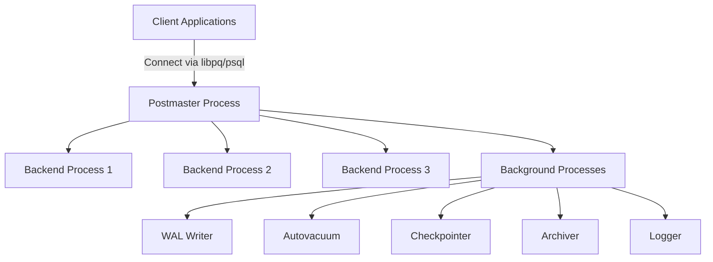
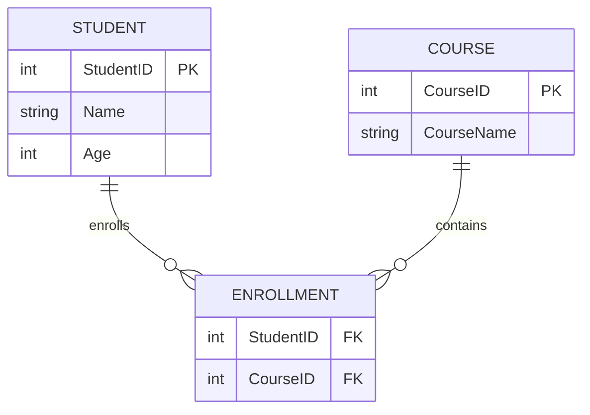

## 🧠 **Data Basics**

### What is Data?

* **Data** is a piece of information that represents facts, observations, or measurements.
* It might be **important** to preserve for **future reference** and **decision-making**.
* Examples: Student name, salary amount, temperature reading, etc.

---

## 📊 **Types of Data**

| Type                     | Description                                                                          | Example Systems / Format                                                                 |
| ------------------------ | ------------------------------------------------------------------------------------ | ---------------------------------------------------------------------------------------- |
| **Structured Data**      | Organized in **rows and columns** (tabular form). Easy to store, query, and analyze. | RDBMS: **MySQL**, **SQL Server**, **Oracle**, **PostgreSQL**                             |
| **Semi-Structured Data** | Has some structure but not strictly tabular; stored as key-value pairs or JSON.      | NoSQL DBs: **MongoDB**, **Cassandra**, **Redis**                                         |
| **Unstructured Data**    | Has no predefined format or organization. Requires special tools to process.         | **Photos**, **Videos**, **Audio**, **PDFs** stored in **AWS S3**, **Azure Blob Storage** |

---

## 🗃️ **Database**

### Definition

A **database** is a software system used to **store, organize, and manage** data efficiently.

### Characteristics

* Stores **organized collections** of related information.
* Supports **easy access, management, and updating**.
* Organizes data in **tables (rows and columns)**.
* Supports **indexes** to find data efficiently.

---

## 🧩 **RDBMS (Relational Database Management System)**

### What is RDBMS?

An **RDBMS** stores data in the form of **tables** (relations), where:

* Each **table** represents an **entity** (e.g., `Student`, `Course`).
* Each **row** represents a **record**.
* Each **column** represents an **attribute**.

Tables can be **related** through **keys** (Primary, Foreign).

### Examples

* **MySQL**
* **PostgreSQL**
* **Oracle**
* **SQL Server**

---

### ✅ **Key Features of RDBMS**

1. **Structured storage** of data in tables.
2. Supports **SQL (Structured Query Language)** for CRUD operations.
3. Maintains **relationships** between data using keys and constraints.
4. Ensures **data integrity** through rules (e.g., foreign key constraints).
5. Supports **transactions** (ACID properties – Atomicity, Consistency, Isolation, Durability).
6. Allows **indexing** for faster retrieval.
7. Supports **Joins** to combine data from multiple tables.

---

### 🧮 Example

**Tables:**

* `Student (StudentID, Name, Age, CourseID)`
* `Course (CourseID, CourseName, Duration)`

**Relationship:**
One Course → Many Students (One-to-Many relationship).

**Sample Query:**

```sql
SELECT s.Name, c.CourseName
FROM Student s
JOIN Course c ON s.CourseID = c.CourseID;
```

---

## 🏗️ **PostgreSQL Architecture Overview**

PostgreSQL is an **open-source object-relational database system (ORDBMS)** built for performance, extensibility, and compliance with the SQL standard.

### ⚙️ **Core Components**

| Component                          | Description                                                                                 |
| ---------------------------------- | ------------------------------------------------------------------------------------------- |
| **PostgreSQL Server (postmaster)** | Main daemon that manages all connections, processes, and background tasks.                  |
| **Shared Memory**                  | Holds caches (e.g., shared buffers), locks, and metadata accessed by all backend processes. |
| **Background Processes**           | Worker processes running in parallel for maintenance tasks.                                 |
| **WAL (Write-Ahead Log)**          | Ensures **data durability** by logging every change before writing to data files.           |
| **Data Files**                     | Physical files under the `data/` directory storing table, index, and configuration data.    |
| **Client**                         | Application or user connecting via tools (psql, pgAdmin, DBeaver, etc.).                    |

### 🧩 **Process Architecture**



**Explanation of Key Background Processes:**

* **WAL Writer:** Writes logs to disk for durability.
* **Checkpointer:** Flushes modified data to disk periodically.
* **Autovacuum:** Frees space and prevents table bloat.
* **Archiver:** Copies WAL segments for backup.
* **Logger:** Captures query and error logs.

---

# 🧩 **Entities, Relationships, Data Types & SQL Statements**

---

## 🧱 **Entity**

* An **Entity** represents any **real-world object, person, place, or concept** that can have data stored about it.
* Each entity becomes a **table** in a database, and each property of that entity becomes a **column**.

| Example Entity | Attributes (Columns)                  |
| -------------- | ------------------------------------- |
| **Student**    | StudentID, Name, Age, Email, CourseID |
| **Course**     | CourseID, CourseName, Duration        |

🧠 *Think of an Entity as a “noun” — something you can store information about.*

---

## 🔗 **Relationships**

Relationships define how entities (tables) are **logically connected** to one another.

| Type                   | Description                                                                               | Example                                                 |
| ---------------------- | ----------------------------------------------------------------------------------------- | ------------------------------------------------------- |
| **One-to-One (1:1)**   | One record in Table A relates to **only one** record in Table B.                          | Each **User** has one **Profile**.                      |
| **One-to-Many (1:N)**  | One record in Table A relates to **many** records in Table B.                             | One **Course** → many **Students**.                     |
| **Many-to-Many (M:N)** | Many records in Table A relate to many in Table B. (Implemented via a **junction table**) | **Students** enroll in many **Courses** and vice-versa. |

### 🧮 Example ER Diagram



---

## 🔢 **Data Types**

Data types define **what kind of values** can be stored in a column.

### 1️⃣ **Numeric Data Types**

Used to store numbers.

| Type              | Description                      | Example           |
| ----------------- | -------------------------------- | ----------------- |
| `TINYINT`         | Very small integer (–128 to 127) | Age               |
| `SMALLINT`        | Small integer                    | Quantity          |
| `INT`             | Standard integer                 | EmployeeID        |
| `BIGINT`          | Very large integer               | Population        |
| `FLOAT`, `DOUBLE` | Decimal values (approximate)     | Marks, Percentage |

---

### 2️⃣ **Date and Time Data Types**

Used to store time-related values.

| Type        | Description                   | Example               |
| ----------- | ----------------------------- | --------------------- |
| `DATE`      | Stores only date (YYYY-MM-DD) | `2025-10-30`          |
| `TIME`      | Stores only time (HH:MM:SS)   | `14:30:00`            |
| `DATETIME`  | Stores both date and time     | `2025-10-30 14:30:00` |
| `TIMESTAMP` | Auto-updated datetime         | Record creation time  |
| `YEAR`      | Year value (4 digits)         | `2025`                |

---

### 3️⃣ **String Data Types**

Used to store text.

| Type         | Description                                                               | Example                                    |
| ------------ | ------------------------------------------------------------------------- | ------------------------------------------ |
| `CHAR(n)`    | Fixed length string. Always allocates **n** bytes (faster).               | `'ABC'` stored as `'ABC·················'` |
| `VARCHAR(n)` | Variable length string. Allocates only required bytes (memory efficient). | `'ABC'` stored as `'ABC'`                  |
| `TEXT`       | Large text (up to 65,535 characters).                                     | Comments, descriptions                     |

🧠 **Performance Note:**

* Use `CHAR` for fixed-length data like `PIN Code`, `Gender`, `Status`.
* Use `VARCHAR` for variable-length data like `Name`, `Email`, `Address`.

---

## 💬 **SQL Statements**

**SQL (Structured Query Language)** is used to **create, read, update, and delete** data in a database.

### 🧱 **Types of SQL Statements**

| Category | Full Form                    | Purpose                                                             | Examples                              |
| -------- | ---------------------------- | ------------------------------------------------------------------- | ------------------------------------- |
| **DDL**  | Data Definition Language     | Defines **structure** of database objects (tables, views, indexes). | `CREATE`, `ALTER`, `DROP`, `TRUNCATE` |
| **DML**  | Data Manipulation Language   | Used to **insert, update, delete** data in tables.                  | `INSERT`, `UPDATE`, `DELETE`          |
| **DQL**  | Data Query Language          | Used to **query** data.                                             | `SELECT`                              |
| **TCL**  | Transaction Control Language | Manages **transactions** and commits/rollbacks.                     | `COMMIT`, `ROLLBACK`, `SAVEPOINT`     |
| **DCL**  | Data Control Language        | Controls **permissions and access**.                                | `GRANT`, `REVOKE`                     |

---

## 🧪 **SQL Examples & Lab Exercises**

### 🧭 **Lab 1 – DDL**

```sql
CREATE TABLE Student (
    StudentID INT PRIMARY KEY AUTO_INCREMENT,
    Name VARCHAR(50) NOT NULL,
    Age INT CHECK (Age >= 18),
    City CHAR(20)
);

ALTER TABLE Student ADD Email VARCHAR(50);
```

---

### 🧮 **Lab 2 – DML**

```sql
INSERT INTO Student (Name, Age, City, Email)
VALUES ('Varun Gupta', 22, 'Delhi', 'varun@example.com');

UPDATE Student SET City = 'Noida' WHERE StudentID = 1;

DELETE FROM Student WHERE StudentID = 5;
```

---

### 🔍 **Lab 3 – DQL**

```sql
SELECT * FROM Student;
SELECT Name, City FROM Student WHERE Age > 20;
SELECT COUNT(*) FROM Student;
```

---

### 💾 **Lab 4 – TCL**

```sql
BEGIN;
UPDATE Student SET City = 'Mumbai' WHERE StudentID = 2;
ROLLBACK; -- undo change

BEGIN;
UPDATE Student SET City = 'Pune' WHERE StudentID = 2;
COMMIT; -- permanently save change
```

---

### 🔐 **Lab 5 – DCL**

```sql
GRANT SELECT, INSERT ON Student TO trainee_user;
REVOKE DELETE ON Student FROM trainee_user;
```

---

