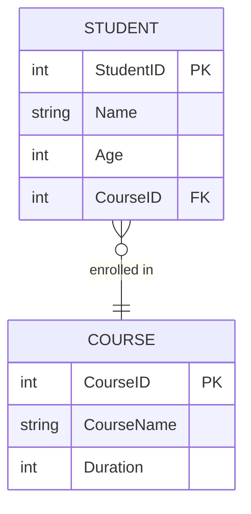

# 🧩 **ER Model (Entity Relationship Model)**

### **Entity**

An object or concept that stores data.
Examples: `Student`, `Course`, `Department`.

### **Attribute**

A property or field that describes an entity.
Examples: `StudentName`, `Age`, `CourseName`.

### **Relationship**

Describes how two entities are related.
Examples:

* `Student` *enrolls in* `Course`
* `Course` *belongs to* `Department`

---

# 💡 **Hands-on Lab Exercise: ERD and Table Creation**

### 🧭 Objective

Create a simple normalized database for a college system.

### ✅ Steps

1. **Create a Database**

   ```sql
   CREATE DATABASE college_db;
   USE college_db;
   ```

2. **Create Tables**

   ```sql
   CREATE TABLE Department (
       DeptID INT PRIMARY KEY AUTO_INCREMENT,
       DeptName VARCHAR(50) NOT NULL
   );

   CREATE TABLE Course (
       CourseID INT PRIMARY KEY AUTO_INCREMENT,
       CourseName VARCHAR(50),
       Duration INT,
       DeptID INT,
       FOREIGN KEY (DeptID) REFERENCES Department(DeptID)
   );

   CREATE TABLE Student (
       StudentID INT PRIMARY KEY AUTO_INCREMENT,
       StudentName VARCHAR(50),
       Age INT CHECK (Age >= 18),
       CourseID INT,
       FOREIGN KEY (CourseID) REFERENCES Course(CourseID)
   );
   ```

3. **Insert Data**

   ```sql
   INSERT INTO Department (DeptName) VALUES ('Computer Science'), ('Mathematics');

   INSERT INTO Course (CourseName, Duration, DeptID)
   VALUES ('Database Systems', 6, 1), ('Calculus', 4, 2);

   INSERT INTO Student (StudentName, Age, CourseID)
   VALUES ('Varun Gupta', 22, 1), ('Neha Sharma', 21, 2);
   ```

4. **Retrieve Data Using Joins**

   ```sql
   SELECT s.StudentName, c.CourseName, d.DeptName
   FROM Student s
   JOIN Course c ON s.CourseID = c.CourseID
   JOIN Department d ON c.DeptID = d.DeptID;
   ```

---


# 🧱 **Database Keys, Constraints, and Relationships**

---

## 🔑 **Database Keys**

**Keys** are special fields used to **uniquely identify** a record or to **create relationships** between tables.

| Key Type          | Description                                                                                       | Example                                             |
| ----------------- | ------------------------------------------------------------------------------------------------- | --------------------------------------------------- |
| **Primary Key**   | A column (or set of columns) that **uniquely identifies each record** in a table. Cannot be NULL. | `StudentID` in `Student` table                      |
| **Foreign Key**   | A column that **refers to the Primary Key** of another table to create a relationship.            | `CourseID` in `Student` refers to `Course.CourseID` |
| **Composite Key** | A key made up of **two or more columns** that together uniquely identify a record.                | `(OrderID, ProductID)` in `OrderDetails`            |
| **Unique Key**    | Ensures that **all values are distinct**, but allows **one NULL** (differs from Primary Key).     | `Email` in `Users`                                  |
| **Candidate Key** | All possible keys that could serve as a Primary Key.                                              | `StudentID`, `Email`                                |
| **Alternate Key** | Candidate Keys **not chosen** as Primary Key.                                                     | If `StudentID` is Primary, `Email` is Alternate     |
| **Surrogate Key** | An **artificial or system-generated key** (e.g., Auto Increment ID).                              | `ID` column with `AUTO_INCREMENT`                   |

---

## 🧱 **Database Constraints**

Constraints are **rules** enforced on data in tables to ensure **data integrity** and **consistency**.

| Constraint      | Purpose                                                   | Example                                              |
| --------------- | --------------------------------------------------------- | ---------------------------------------------------- |
| **NOT NULL**    | Ensures a column cannot have NULL value.                  | `Name VARCHAR(50) NOT NULL`                          |
| **UNIQUE**      | Ensures all values are unique in that column.             | `Email VARCHAR(100) UNIQUE`                          |
| **PRIMARY KEY** | Combines NOT NULL + UNIQUE; identifies each row uniquely. | `PRIMARY KEY (StudentID)`                            |
| **FOREIGN KEY** | Enforces a relationship between two tables.               | `FOREIGN KEY (CourseID) REFERENCES Course(CourseID)` |
| **CHECK**       | Ensures a condition is true for each row.                 | `CHECK (Age >= 18)`                                  |
| **DEFAULT**     | Assigns a default value when none is provided.            | `Status VARCHAR(10) DEFAULT 'Active'`                |

---

## 🔗 **Database Relationships**

Relationships define **how tables are connected** to each other.

| Relationship Type      | Description                                                                        | Example                                        |
| ---------------------- | ---------------------------------------------------------------------------------- | ---------------------------------------------- |
| **One-to-One (1:1)**   | One record in Table A relates to **only one** record in Table B.                   | A `User` has **one Profile**.                  |
| **One-to-Many (1:N)**  | One record in Table A can relate to **multiple** records in Table B.               | One `Course` → many `Students`.                |
| **Many-to-Many (M:N)** | Many records in Table A relate to many in Table B (requires a **junction table**). | `Student` ↔ `Course` (via `Enrollment` table). |

**Example ERD (Entity Relationship Diagram):**



---

# 🧮 **Normalization**

Normalization is the process of **organizing data** to eliminate redundancy and improve **data integrity**.

| Normal Form                  | Description                                                               | Example / Rule                          |
| ---------------------------- | ------------------------------------------------------------------------- | --------------------------------------- |
| **1NF (First Normal Form)**  | Each cell contains **atomic (single) values**, and each record is unique. | No repeating groups/arrays.             |
| **2NF (Second Normal Form)** | 1NF + all **non-key attributes** fully depend on the **Primary Key**.     | Remove **partial dependencies**.        |
| **3NF (Third Normal Form)**  | 2NF + no **transitive dependencies** (non-key depends only on key).       | Remove derived attributes like “Total”. |

🧠 **Example:**

| Unnormalized Table                      | Normalized (3NF)                                                               |
| --------------------------------------- | ------------------------------------------------------------------------------ |
| StudentID, Name, CourseName, Instructor | Split into `Student`, `Course`, `Instructor` tables with keys & relationships. |

---