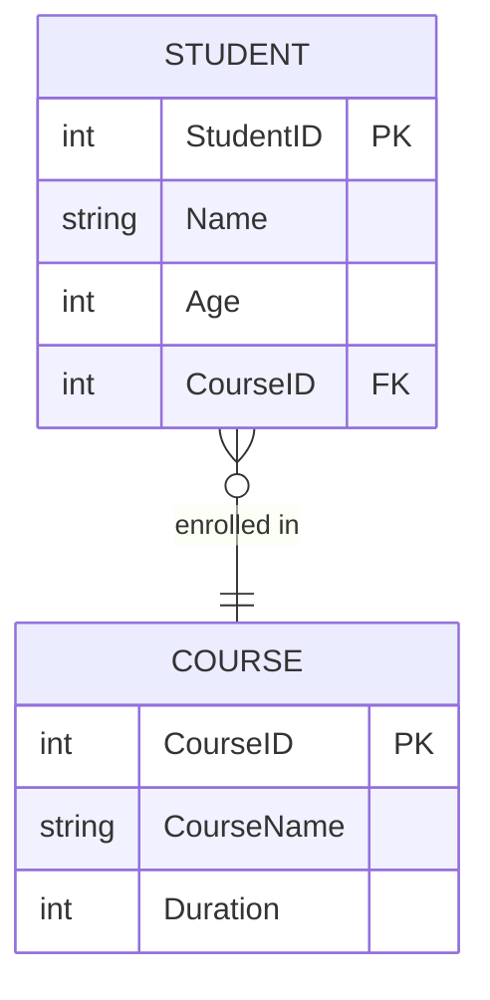
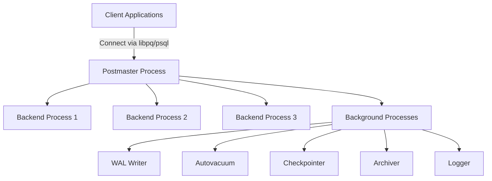
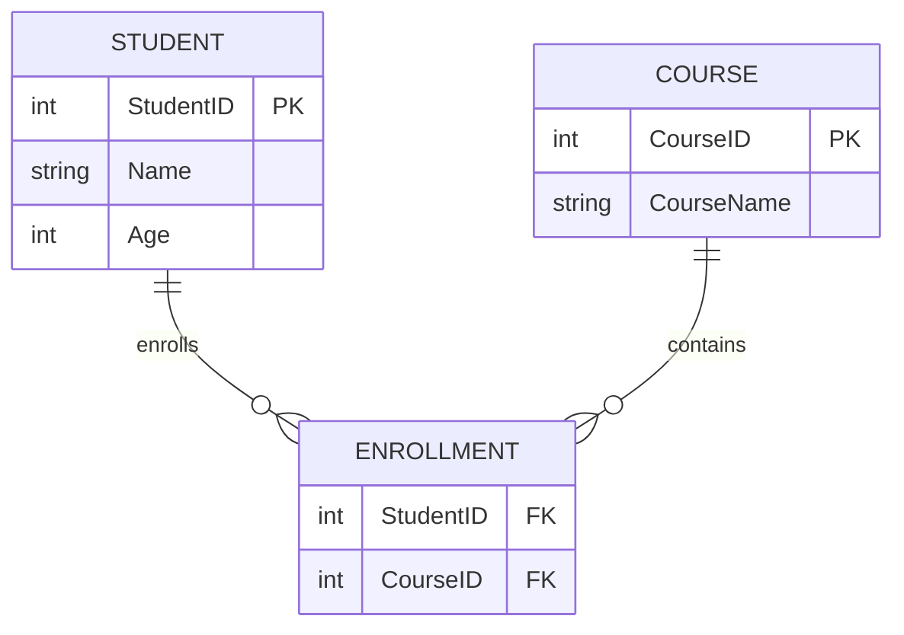

## 🧠 **Data Basics**

### What is Data?

* **Data** is a piece of information that represents facts, observations, or measurements.
* It might be **important** to preserve for **future reference** and **decision-making**.
* Examples: Student name, salary amount, temperature reading, etc.

---

## 📊 **Types of Data**

| Type                     | Description                                                                          | Example Systems / Format                                                                 |
| ------------------------ | ------------------------------------------------------------------------------------ | ---------------------------------------------------------------------------------------- |
| **Structured Data**      | Organized in **rows and columns** (tabular form). Easy to store, query, and analyze. | RDBMS: **MySQL**, **SQL Server**, **Oracle**, **PostgreSQL**                             |
| **Semi-Structured Data** | Has some structure but not strictly tabular; stored as key-value pairs or JSON.      | NoSQL DBs: **MongoDB**, **Cassandra**, **Redis**                                         |
| **Unstructured Data**    | Has no predefined format or organization. Requires special tools to process.         | **Photos**, **Videos**, **Audio**, **PDFs** stored in **AWS S3**, **Azure Blob Storage** |

---

## 🗃️ **Database**

### Definition

A **database** is a software system used to **store, organize, and manage** data efficiently.

### Characteristics

* Stores **organized collections** of related information.
* Supports **easy access, management, and updating**.
* Organizes data in **tables (rows and columns)**.
* Supports **indexes** to find data efficiently.

---

## 🧩 **RDBMS (Relational Database Management System)**

### What is RDBMS?

An **RDBMS** stores data in the form of **tables** (relations), where:

* Each **table** represents an **entity** (e.g., `Student`, `Course`).
* Each **row** represents a **record**.
* Each **column** represents an **attribute**.

Tables can be **related** through **keys** (Primary, Foreign).

### Examples

* **MySQL**
* **PostgreSQL**
* **Oracle**
* **SQL Server**

---

### ✅ **Key Features of RDBMS**

1. **Structured storage** of data in tables.
2. Supports **SQL (Structured Query Language)** for CRUD operations.
3. Maintains **relationships** between data using keys and constraints.
4. Ensures **data integrity** through rules (e.g., foreign key constraints).
5. Supports **transactions** (ACID properties – Atomicity, Consistency, Isolation, Durability).
6. Allows **indexing** for faster retrieval.
7. Supports **Joins** to combine data from multiple tables.

---

### 🧮 Example

**Tables:**

* `Student (StudentID, Name, Age, CourseID)`
* `Course (CourseID, CourseName, Duration)`

**Relationship:**
One Course → Many Students (One-to-Many relationship).

**Sample Query:**

```sql
SELECT s.Name, c.CourseName
FROM Student s
JOIN Course c ON s.CourseID = c.CourseID;
```

---

# 🧱 **Database Keys, Constraints, and Relationships**

---

## 🔑 **Database Keys**

**Keys** are special fields used to **uniquely identify** a record or to **create relationships** between tables.

| Key Type          | Description                                                                                       | Example                                             |
| ----------------- | ------------------------------------------------------------------------------------------------- | --------------------------------------------------- |
| **Primary Key**   | A column (or set of columns) that **uniquely identifies each record** in a table. Cannot be NULL. | `StudentID` in `Student` table                      |
| **Foreign Key**   | A column that **refers to the Primary Key** of another table to create a relationship.            | `CourseID` in `Student` refers to `Course.CourseID` |
| **Composite Key** | A key made up of **two or more columns** that together uniquely identify a record.                | `(OrderID, ProductID)` in `OrderDetails`            |
| **Unique Key**    | Ensures that **all values are distinct**, but allows **one NULL** (differs from Primary Key).     | `Email` in `Users`                                  |
| **Candidate Key** | All possible keys that could serve as a Primary Key.                                              | `StudentID`, `Email`                                |
| **Alternate Key** | Candidate Keys **not chosen** as Primary Key.                                                     | If `StudentID` is Primary, `Email` is Alternate     |
| **Surrogate Key** | An **artificial or system-generated key** (e.g., Auto Increment ID).                              | `ID` column with `AUTO_INCREMENT`                   |

---

## 🧱 **Database Constraints**

Constraints are **rules** enforced on data in tables to ensure **data integrity** and **consistency**.

| Constraint      | Purpose                                                   | Example                                              |
| --------------- | --------------------------------------------------------- | ---------------------------------------------------- |
| **NOT NULL**    | Ensures a column cannot have NULL value.                  | `Name VARCHAR(50) NOT NULL`                          |
| **UNIQUE**      | Ensures all values are unique in that column.             | `Email VARCHAR(100) UNIQUE`                          |
| **PRIMARY KEY** | Combines NOT NULL + UNIQUE; identifies each row uniquely. | `PRIMARY KEY (StudentID)`                            |
| **FOREIGN KEY** | Enforces a relationship between two tables.               | `FOREIGN KEY (CourseID) REFERENCES Course(CourseID)` |
| **CHECK**       | Ensures a condition is true for each row.                 | `CHECK (Age >= 18)`                                  |
| **DEFAULT**     | Assigns a default value when none is provided.            | `Status VARCHAR(10) DEFAULT 'Active'`                |

---

## 🔗 **Database Relationships**

Relationships define **how tables are connected** to each other.

| Relationship Type      | Description                                                                        | Example                                        |
| ---------------------- | ---------------------------------------------------------------------------------- | ---------------------------------------------- |
| **One-to-One (1:1)**   | One record in Table A relates to **only one** record in Table B.                   | A `User` has **one Profile**.                  |
| **One-to-Many (1:N)**  | One record in Table A can relate to **multiple** records in Table B.               | One `Course` → many `Students`.                |
| **Many-to-Many (M:N)** | Many records in Table A relate to many in Table B (requires a **junction table**). | `Student` ↔ `Course` (via `Enrollment` table). |

**Example ERD (Entity Relationship Diagram):**



---

# 🧮 **Normalization**

Normalization is the process of **organizing data** to eliminate redundancy and improve **data integrity**.

| Normal Form                  | Description                                                               | Example / Rule                          |
| ---------------------------- | ------------------------------------------------------------------------- | --------------------------------------- |
| **1NF (First Normal Form)**  | Each cell contains **atomic (single) values**, and each record is unique. | No repeating groups/arrays.             |
| **2NF (Second Normal Form)** | 1NF + all **non-key attributes** fully depend on the **Primary Key**.     | Remove **partial dependencies**.        |
| **3NF (Third Normal Form)**  | 2NF + no **transitive dependencies** (non-key depends only on key).       | Remove derived attributes like “Total”. |

🧠 **Example:**

| Unnormalized Table                      | Normalized (3NF)                                                               |
| --------------------------------------- | ------------------------------------------------------------------------------ |
| StudentID, Name, CourseName, Instructor | Split into `Student`, `Course`, `Instructor` tables with keys & relationships. |

---

# 🧩 **ER Model (Entity Relationship Model)**

### **Entity**

An object or concept that stores data.
Examples: `Student`, `Course`, `Department`.

### **Attribute**

A property or field that describes an entity.
Examples: `StudentName`, `Age`, `CourseName`.

### **Relationship**

Describes how two entities are related.
Examples:

* `Student` *enrolls in* `Course`
* `Course` *belongs to* `Department`

---

# 💡 **Hands-on Lab Exercise: ERD and Table Creation**

### 🧭 Objective

Create a simple normalized database for a college system.

### ✅ Steps

1. **Create a Database**

   ```sql
   CREATE DATABASE college_db;
   USE college_db;
   ```

2. **Create Tables**

   ```sql
   CREATE TABLE Department (
       DeptID INT PRIMARY KEY AUTO_INCREMENT,
       DeptName VARCHAR(50) NOT NULL
   );

   CREATE TABLE Course (
       CourseID INT PRIMARY KEY AUTO_INCREMENT,
       CourseName VARCHAR(50),
       Duration INT,
       DeptID INT,
       FOREIGN KEY (DeptID) REFERENCES Department(DeptID)
   );

   CREATE TABLE Student (
       StudentID INT PRIMARY KEY AUTO_INCREMENT,
       StudentName VARCHAR(50),
       Age INT CHECK (Age >= 18),
       CourseID INT,
       FOREIGN KEY (CourseID) REFERENCES Course(CourseID)
   );
   ```

3. **Insert Data**

   ```sql
   INSERT INTO Department (DeptName) VALUES ('Computer Science'), ('Mathematics');

   INSERT INTO Course (CourseName, Duration, DeptID)
   VALUES ('Database Systems', 6, 1), ('Calculus', 4, 2);

   INSERT INTO Student (StudentName, Age, CourseID)
   VALUES ('Varun Gupta', 22, 1), ('Neha Sharma', 21, 2);
   ```

4. **Retrieve Data Using Joins**

   ```sql
   SELECT s.StudentName, c.CourseName, d.DeptName
   FROM Student s
   JOIN Course c ON s.CourseID = c.CourseID
   JOIN Department d ON c.DeptID = d.DeptID;
   ```

---


# 🧱 **Module 1 (Part 2): PostgreSQL Architecture, Authentication, Backup & Recovery, and Scaling**

---

## 🏗️ **PostgreSQL Architecture Overview**

PostgreSQL is an **open-source object-relational database system (ORDBMS)** built for performance, extensibility, and compliance with the SQL standard.

### ⚙️ **Core Components**

| Component                          | Description                                                                                 |
| ---------------------------------- | ------------------------------------------------------------------------------------------- |
| **PostgreSQL Server (postmaster)** | Main daemon that manages all connections, processes, and background tasks.                  |
| **Shared Memory**                  | Holds caches (e.g., shared buffers), locks, and metadata accessed by all backend processes. |
| **Background Processes**           | Worker processes running in parallel for maintenance tasks.                                 |
| **WAL (Write-Ahead Log)**          | Ensures **data durability** by logging every change before writing to data files.           |
| **Data Files**                     | Physical files under the `data/` directory storing table, index, and configuration data.    |
| **Client**                         | Application or user connecting via tools (psql, pgAdmin, DBeaver, etc.).                    |

### 🧩 **Process Architecture**



**Explanation of Key Background Processes:**

* **WAL Writer:** Writes logs to disk for durability.
* **Checkpointer:** Flushes modified data to disk periodically.
* **Autovacuum:** Frees space and prevents table bloat.
* **Archiver:** Copies WAL segments for backup.
* **Logger:** Captures query and error logs.

---

## 🔐 **Authentication & Security**

### 🧭 **Authentication Methods**

PostgreSQL stores connection rules in `pg_hba.conf` (Host Based Authentication).

| Method                             | Description                                         | Example               |
| ---------------------------------- | --------------------------------------------------- | --------------------- |
| **trust**                          | No password required. *(Unsafe for production)*     | For local development |
| **password / md5 / scram-sha-256** | Uses password authentication (MD5 or SCRAM-SHA).    | Standard login        |
| **peer**                           | Matches the system username with database username. | For local OS users    |
| **ident**                          | External service verifies the username.             | For remote OS users   |
| **cert**                           | SSL certificate authentication.                     | Enterprise security   |

### 🔒 **Encryption**

| Type                        | Description                                                                    |
| --------------------------- | ------------------------------------------------------------------------------ |
| **SSL/TLS Encryption**      | Secures client–server connections using certificates.                          |
| **Data-at-Rest Encryption** | Encrypts disk-level data (via OS or external tools like LUKS, EBS encryption). |
| **Column-Level Encryption** | Encrypts sensitive columns (e.g., AES functions).                              |

**Example: Enable SSL**

```bash
ssl = on
ssl_cert_file = 'server.crt'
ssl_key_file = 'server.key'
```

---

## 💾 **Backup & Recovery**

PostgreSQL supports **physical** and **logical** backups.

### 🧱 **Backup Types**

| Type                                     | Description                                                 | Tools                   |
| ---------------------------------------- | ----------------------------------------------------------- | ----------------------- |
| **Logical Backup**                       | Exports data as SQL statements.                             | `pg_dump`, `pg_dumpall` |
| **Physical Backup**                      | Copies actual data files (used for point-in-time recovery). | `pg_basebackup`         |
| **Continuous Archiving (WAL Archiving)** | Stores WAL segments for replay.                             | `archive_mode = on`     |

### 🧰 **Commands**

**Logical Backup**

```bash
pg_dump -U postgres -d college_db -F c -f college_backup.dump
```

**Restore**

```bash
pg_restore -U postgres -d college_db_restored college_backup.dump
```

**Full Physical Backup**

```bash
pg_basebackup -h localhost -U postgres -D /var/backups/pg -Ft -z -P
```

---

## 🔁 **Point-in-Time Recovery (PITR)**

Used to **restore the database to a specific moment** before an error or failure.

### 🧭 **Steps**

1. Enable WAL archiving in `postgresql.conf`:

   ```bash
   archive_mode = on
   archive_command = 'cp %p /mnt/archive/%f'
   ```
2. Take a base backup.
3. Restore base backup to a new data directory.
4. Create a `recovery.conf` file:

   ```bash
   restore_command = 'cp /mnt/archive/%f %p'
   recovery_target_time = '2025-10-30 15:45:00'
   ```
5. Start PostgreSQL — it replays WAL files up to that timestamp.

---

## 🚀 **Performance & Scaling**

### 🔄 **Vertical Scaling**

Increase resources of a single server:

* More CPU, RAM, faster disk (SSD/NVMe)
* Tune configs: `shared_buffers`, `work_mem`, `maintenance_work_mem`, etc.

### 🧩 **Horizontal Scaling**

| Approach           | Description                                                             |
| ------------------ | ----------------------------------------------------------------------- |
| **Read Replicas**  | Stream replication for read-only copies to distribute read load.        |
| **Load Balancing** | Middleware (e.g., Pgpool-II, HAProxy) distributes traffic.              |
| **Sharding**       | Splits large datasets across multiple nodes. Tools: Citus, CockroachDB. |

### ⚙️ **Connection Pooling**

Reduces overhead by reusing connections.
Tools: **pgBouncer**, **Pgpool-II**

---

## 🧪 **Lab Exercises**

### 🧭 Lab 1 – View Architecture Info

```sql
-- Check version
SELECT version();

-- List databases and connections
\l
SELECT * FROM pg_stat_activity;

-- Check background processes
SELECT * FROM pg_stat_bgwriter;
```

### 💾 Lab 2 – Take Backup and Restore

```bash
pg_dump -U postgres -d companydb -F c -f companydb.dump
createdb companydb_restore
pg_restore -U postgres -d companydb_restore companydb.dump
```

### 🧠 Lab 3 – Create a Read Replica (Simulation)

1. Enable WAL streaming:

   ```bash
   wal_level = replica
   max_wal_senders = 3
   ```
2. Use `pg_basebackup` to clone primary to a secondary server.
3. Start replica with `standby.signal` file.

---

## 🧾 **Summary**

| Area                  | Key Takeaway                                                               |
| --------------------- | -------------------------------------------------------------------------- |
| **Architecture**      | PostgreSQL = postmaster + backends + WAL + background processes.           |
| **Authentication**    | Managed via `pg_hba.conf`, supports md5, scram, peer, SSL.                 |
| **Backup & Recovery** | Use `pg_dump` for logical, `pg_basebackup` for physical, and WAL for PITR. |
| **Scaling**           | Start with vertical tuning, then add read replicas or sharding for growth. |

---


Excellent continuation, Varun 👏
You’re building a perfect foundational series for your **“RDBMS & SQL Fundamentals”** module.
Let’s refine and extend your notes to make them **training-ready**, classroom-presentable, and include examples + lab exercises, in your typical structured format.

---

# 🧩 **Entities, Relationships, Data Types & SQL Statements**

---

## 🧱 **Entity**

* An **Entity** represents any **real-world object, person, place, or concept** that can have data stored about it.
* Each entity becomes a **table** in a database, and each property of that entity becomes a **column**.

| Example Entity | Attributes (Columns)                  |
| -------------- | ------------------------------------- |
| **Student**    | StudentID, Name, Age, Email, CourseID |
| **Course**     | CourseID, CourseName, Duration        |

🧠 *Think of an Entity as a “noun” — something you can store information about.*

---

## 🔗 **Relationships**

Relationships define how entities (tables) are **logically connected** to one another.

| Type                   | Description                                                                               | Example                                                 |
| ---------------------- | ----------------------------------------------------------------------------------------- | ------------------------------------------------------- |
| **One-to-One (1:1)**   | One record in Table A relates to **only one** record in Table B.                          | Each **User** has one **Profile**.                      |
| **One-to-Many (1:N)**  | One record in Table A relates to **many** records in Table B.                             | One **Course** → many **Students**.                     |
| **Many-to-Many (M:N)** | Many records in Table A relate to many in Table B. (Implemented via a **junction table**) | **Students** enroll in many **Courses** and vice-versa. |

### 🧮 Example ER Diagram



---

## 🔢 **Data Types**

Data types define **what kind of values** can be stored in a column.

### 1️⃣ **Numeric Data Types**

Used to store numbers.

| Type              | Description                      | Example           |
| ----------------- | -------------------------------- | ----------------- |
| `TINYINT`         | Very small integer (–128 to 127) | Age               |
| `SMALLINT`        | Small integer                    | Quantity          |
| `INT`             | Standard integer                 | EmployeeID        |
| `BIGINT`          | Very large integer               | Population        |
| `FLOAT`, `DOUBLE` | Decimal values (approximate)     | Marks, Percentage |

---

### 2️⃣ **Date and Time Data Types**

Used to store time-related values.

| Type        | Description                   | Example               |
| ----------- | ----------------------------- | --------------------- |
| `DATE`      | Stores only date (YYYY-MM-DD) | `2025-10-30`          |
| `TIME`      | Stores only time (HH:MM:SS)   | `14:30:00`            |
| `DATETIME`  | Stores both date and time     | `2025-10-30 14:30:00` |
| `TIMESTAMP` | Auto-updated datetime         | Record creation time  |
| `YEAR`      | Year value (4 digits)         | `2025`                |

---

### 3️⃣ **String Data Types**

Used to store text.

| Type         | Description                                                               | Example                                    |
| ------------ | ------------------------------------------------------------------------- | ------------------------------------------ |
| `CHAR(n)`    | Fixed length string. Always allocates **n** bytes (faster).               | `'ABC'` stored as `'ABC·················'` |
| `VARCHAR(n)` | Variable length string. Allocates only required bytes (memory efficient). | `'ABC'` stored as `'ABC'`                  |
| `TEXT`       | Large text (up to 65,535 characters).                                     | Comments, descriptions                     |

🧠 **Performance Note:**

* Use `CHAR` for fixed-length data like `PIN Code`, `Gender`, `Status`.
* Use `VARCHAR` for variable-length data like `Name`, `Email`, `Address`.

---

## 💬 **SQL Statements**

**SQL (Structured Query Language)** is used to **create, read, update, and delete** data in a database.

### 🧱 **Types of SQL Statements**

| Category | Full Form                    | Purpose                                                             | Examples                              |
| -------- | ---------------------------- | ------------------------------------------------------------------- | ------------------------------------- |
| **DDL**  | Data Definition Language     | Defines **structure** of database objects (tables, views, indexes). | `CREATE`, `ALTER`, `DROP`, `TRUNCATE` |
| **DML**  | Data Manipulation Language   | Used to **insert, update, delete** data in tables.                  | `INSERT`, `UPDATE`, `DELETE`          |
| **DQL**  | Data Query Language          | Used to **query** data.                                             | `SELECT`                              |
| **TCL**  | Transaction Control Language | Manages **transactions** and commits/rollbacks.                     | `COMMIT`, `ROLLBACK`, `SAVEPOINT`     |
| **DCL**  | Data Control Language        | Controls **permissions and access**.                                | `GRANT`, `REVOKE`                     |

---

## 🧪 **SQL Examples & Lab Exercises**

### 🧭 **Lab 1 – DDL**

```sql
CREATE TABLE Student (
    StudentID INT PRIMARY KEY AUTO_INCREMENT,
    Name VARCHAR(50) NOT NULL,
    Age INT CHECK (Age >= 18),
    City CHAR(20)
);

ALTER TABLE Student ADD Email VARCHAR(50);
```

---

### 🧮 **Lab 2 – DML**

```sql
INSERT INTO Student (Name, Age, City, Email)
VALUES ('Varun Gupta', 22, 'Delhi', 'varun@example.com');

UPDATE Student SET City = 'Noida' WHERE StudentID = 1;

DELETE FROM Student WHERE StudentID = 5;
```

---

### 🔍 **Lab 3 – DQL**

```sql
SELECT * FROM Student;
SELECT Name, City FROM Student WHERE Age > 20;
SELECT COUNT(*) FROM Student;
```

---

### 💾 **Lab 4 – TCL**

```sql
BEGIN;
UPDATE Student SET City = 'Mumbai' WHERE StudentID = 2;
ROLLBACK; -- undo change

BEGIN;
UPDATE Student SET City = 'Pune' WHERE StudentID = 2;
COMMIT; -- permanently save change
```

---

### 🔐 **Lab 5 – DCL**

```sql
GRANT SELECT, INSERT ON Student TO trainee_user;
REVOKE DELETE ON Student FROM trainee_user;
```

---

## 🧾 **Quick Summary**

| Concept             | Key Idea                                  |
| ------------------- | ----------------------------------------- |
| **Entity**          | Real-world object that becomes a table.   |
| **Relationship**    | Logical link between tables.              |
| **Data Types**      | Define what kind of values can be stored. |
| **CHAR vs VARCHAR** | CHAR = faster, VARCHAR = space-efficient. |
| **SQL Statements**  | Classified into DDL, DML, DQL, DCL, TCL.  |

---

